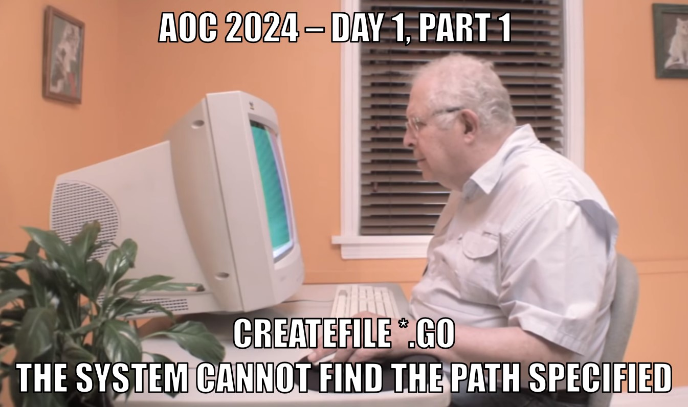

# ⌨️ Advent of Code 2024 solutions

This repository contains my solutions to the [Advent of Code 2024](https://adventofcode.com/2024) challenges. Advent of Code is an Advent calendar of small programming puzzles for a variety of skill sets and skill levels.



## Challenges

The challenges are designed to be solved in any programming language and cover a wide range of topics, including:

- Parsing and processing text
- Implementing algorithms and data structures
- Simulating simple systems and state machines
- Solving mathematical problems

Each day's challenge is divided into two parts, with the second part typically building upon the first part in some way. The challenges are designed to be approachable for beginners, but also offer a challenge for more experienced programmers.

### Directory structure

Each day of the Advent of Code challenge is organized into its own directory, named dayXX, where XX is the day of the challenge (e.g., day01, day02, etc.). Inside most of the day's directories, you will find the following files:

```text
day01
│ input.txt
├── 01_1
│   ├── main.go
│   └── README.md
└── 02_1
    ├── main.go
    └── README.md
```

- `input.txt`: The input data provided by the Advent of Code system for the day's challenge.
- `01_1`: The directory containing the solution to the 1st part of the day's challenge.
- - `main.go`: The solution to the 1st part of the day's challenge.
- - `README.md`: The instructions of the 1st part of the day's challenge.
- `02_1`: The directory containing the solution to the 2nd part of the day's challenge.
- - `main.go`: The solution to the 2nd part of the day's challenge.
- - `README.md`: The instructions of the 2nd part of the day's challenge.

For the problems that I found **very** challenging, several attempts were necessary, and there might be some additional directories containing various attempts, such as `01_2` etc.

### Running the challenges

I used Go to solve these challenges.
You can navigate in the directory structure and run `go run *.go` to retrieve the solutions.
Note that each participant gets a different dataset to work on, therefore, the answers of "my" challenges may not be the same as yours. In that case, you'll need to update the `input.txt` file with your puzzle input.

### Disclaimers

Some of these mind twisting challenges may remain unsolved unfortunately.

Some of the answers to these challenges are not optimized, meaning that it might be necessary to let the script run for a long time before getting the answer of the challenge. I tried to focus on solving the challenges in the first place, and then, if time allows me, I can spend time in solving the challenges _in a good way_. The objective being to take some pleasure in this experience, I really looked for the "excitement rush" of getting the answers right rather than getting the answers beautifully. The objective is to learn things and to have fun after all.

Finally, most of the comments in the code are coming from LLMs which are great tools to write comments and document the code. I use LLMs only to write comments and don't rely on these tools to solve the challenges.

## Contact information

You can contact me via:

- [LinkedIn](https://www.linkedin.com/in/cl3mcg/?locale=en_US)
- [Mastodon](https://fosstodon.org/@cl3mcg)
- [Twitter](https://twitter.com/cl3mcg)

## License

This project and work is licensed under the [CC0 license](https://creativecommons.org/publicdomain/zero/1.0/).
